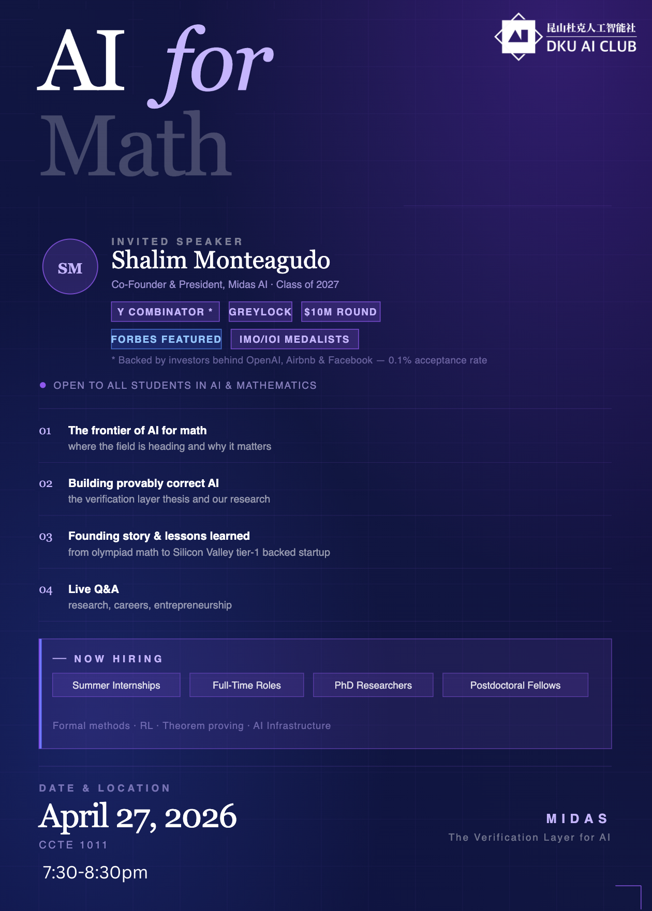

## Topics:
• The future of AI for math
• Building provably correct AI
• Startup journey & lessons
• Live Q&A (research, careers, entrepreneurship)

**Time**：
- 19:30-20:30

Open to all students interested in AI & Mathematics
