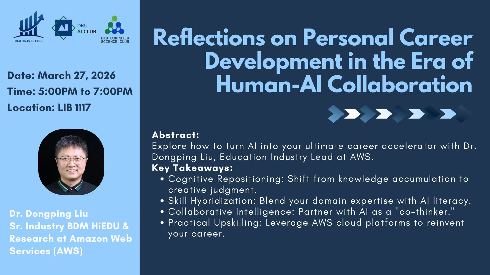

## Abstract

Explore how to turn AI into your ultimate career accelerator with Dr. Dongping Liu, Education Industry Lead at AWS.

**Speaker**: Dr. Dongping Liu  
**Title**: Sr. Industry BDM HiEDU & Research, Amazon Web Services (AWS)

## Key Takeaways

- 🧠 **Cognitive Repositioning**: Shift from knowledge accumulation to creative judgment
- 🔧 **Skill Hybridization**: Blend your domain expertise with AI literacy
- 🤝 **Collaborative Intelligence**: Partner with AI as a co-thinker
- 🚀 **Practical Upskilling**: Leverage AWS cloud platforms to reinvent your career

## Event Details

| Item | Information |
|------|-------------|
| 📅 Date | March 27, 2026 |
| ⏰ Time | 5:00 PM - 7:00 PM |
| 📍 Location | LIB 1117 |

